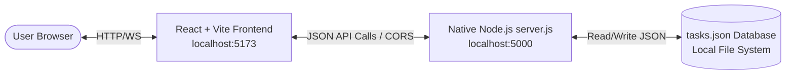

# BASIC CRUD APP— Full Stack Task Workspace

SyncBoard is a lightweight, responsive Kanban task manager built as a multi-package full-stack application. It leverages a modern frontend powered by **React** and **Vite**, paired with a custom backend constructed entirely using the **native Node.js `http` module** (no Express or third-party web frameworks).

---

## 🛠️ Tech Stack & Features

- **Frontend**: React 19, Vite 8, Vanilla CSS (Glassmorphism & custom variables), responsive layouts, and interactive animations.
- **Backend**: Native Node.js HTTP server, asynchronous filesystem (`fs/promises`) database storage, CORS preflight handling, and query string parsing.
- **Database**: Local JSON-based flat-file database (`backend/data/tasks.json`).
- **Concurrent Tooling**: Integrated dev orchestrator to boot both environments concurrently with a single terminal command.

---

## 📁 Project Structure

```text
node-react-crud-app/
├── backend/
│   ├── data/
│   │   └── tasks.json      # JSON flat-file database
│   ├── package.json        # Backend configuration
│   └── server.js           # Native Node.js HTTP server
├── frontend/
│   ├── public/
│   ├── src/
│   │   ├── assets/
│   │   ├── components/     # TaskBoard, TaskCard, TaskForm, Toast
│   │   ├── App.css         # Component & layout specific styles
│   │   ├── App.jsx         # App shell & State Controller
│   │   ├── index.css       # Design System tokens & global styles
│   │   └── main.jsx
│   ├── index.html
│   ├── package.json        # Frontend configuration (Vite, React)
│   └── vite.config.js
├── package.json            # Root configuration for monorepo-like scripts
└── README.md               # Main Documentation (This file)
```

---

## 🚀 Getting Started

### Prerequisites

- **Node.js**: Version 18.x or higher is recommended.
- **npm**: Version 9.x or higher.

### 1. Installation

To install all dependencies across the entire workspace (root, backend, and frontend) in one command, run:

```bash
npm run install:all
```

### 2. Running in Development

You can spin up both the Vite frontend developer server and the Node.js backend server (with file watching enabled) concurrently:

```bash
npm run dev
```

- **Frontend**: Accessible at `http://localhost:5173`
- **Backend API**: Accessible at `http://localhost:5000`

### 3. Individual Service Scripts

If you want to run the servers in separate terminals, you can use the following commands from the root directory:

| Command | Action |
|:---|:---|
| `npm run backend` | Starts the Node.js backend server (`node backend/server.js`) |
| `npm run backend:watch` | Starts the backend server with hot-reload watch mode (`node --watch`) |
| `npm run frontend` | Boots the Vite development server for the frontend app |
| `npm run start` | Alias to start the backend server |

---

## 🧩 Architectural Flow



---

## 🤝 Services Overview

- **[Frontend App README](./frontend/README.md)**: Details regarding the UI component design, the custom theme, and client-side filtering/toasts.
- **[Backend API README](./backend/README.md)**: Specifications for the RESTful endpoints, CORS headers, JSON schema, and request validation.
